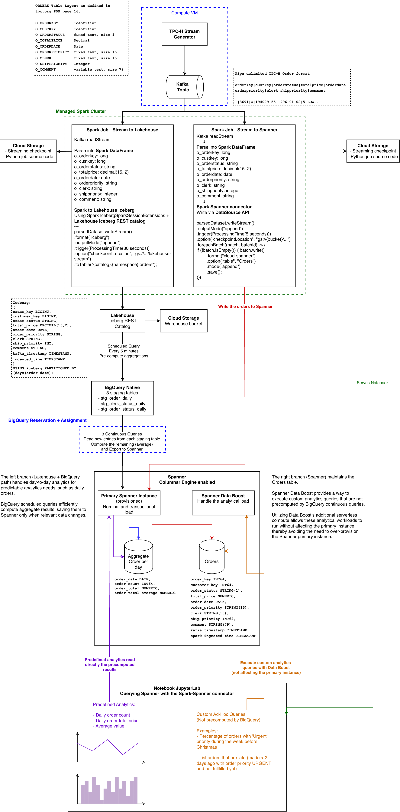

# Spanner DataBoost Streaming Demo

This demo implements a dual-path streaming architecture ingesting orders (TCP-H dataset) where each branch addresses a distinct analytical goal.

The left branch (Lakehouse Aggregates path) handles predictable, day-to-day reporting by precomputing cumulative aggregates, such as daily order totals, and saving them directly into Spanner aggregate tables only when relevant data changes.

The right branch (Direct Spanner path) continuously maintains the raw orders table to support ad-hoc queries not covered by precomputations. By leveraging Spanner Data Boost alongside its columnar engine, these ad-hoc queries run efficiently without impacting the primary Spanner instance, thereby eliminating the need to over-provision it.



### System requirements

- gcloud cli
- uv https://docs.astral.sh/uv/#installation (for dependencies management)
- jq https://jqlang.org/ (for parsing gcloud json response reliably, used by the bash scripts during the notebook)


## Setup

The entire demo architecture notes, GCP infrastructure provisioning, Spark job sources, producer execution, and dashboard/ad-hoc query code is in [`demo.ipynb`](demo.ipynb).

```bash
uv sync
uv run jupyter lab
```

Open `demo.ipynb` and run the cells top to bottom.
